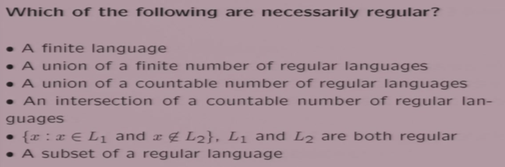
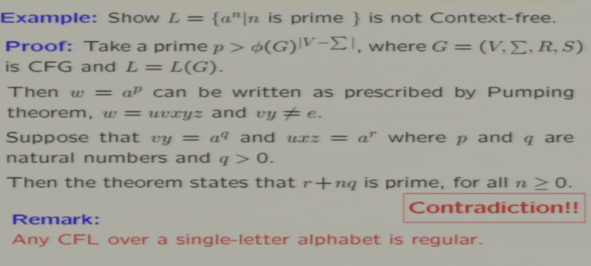
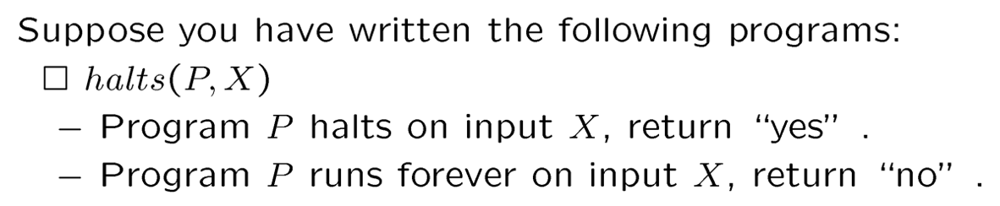
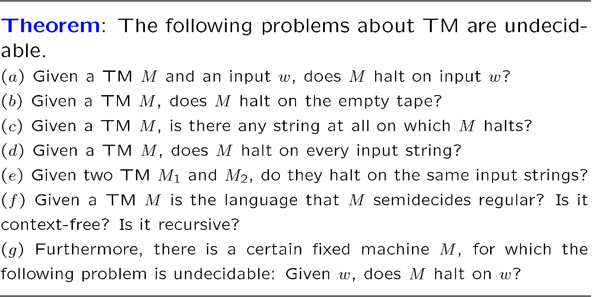
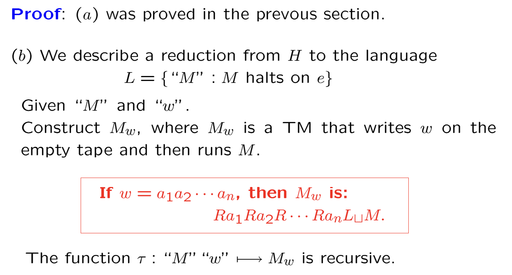

# 第一章 引入语言

## 1.1 集合

- **Power Set**

  $2^A$=A的幂集=A所有子集的集合

- **Partition**

  A的划分为一组A的真子集，他们的交集为空，他们的并集为A

## 1.2 关系

用集合来表达关系：

- **Ordered Pair**
  $$
  (a, b)=(c, d) \iff (a=c)\ \and\ (b=d)
  $$

- **Cartesian Product**
  $$
  A\times B=\{(a, b)|a\in A\ \and\ b\in B\}
  $$

- **Binary Relation on A and B**
  $$
  R\subseteq A\times B
  $$

## 1.3 特殊的二元关系

### 特殊的关系

- **Function** $f:A\rightarrow B\ must\ satisfy$

  - $f\subseteq A\times B$
  - $\forall a\in A,\ \exist\ exactly\ one\ b\in B\ with\ (a, b)\in f$

- **Reflexive**

- **Symmetric / Antisymmetric**

- **Transitive**

  

- **Equivalance**:

  Reflxive && Semmetric && Transitive

- **Partial Order**:

  Reflxive && Antisemmetric && Transitive

- **Full Order**

### 特殊的函数

- **One-to-one Func.**

  a!=b => f(a)!=f(b)

- **Onto Func.**

  any b in B, exist a in A such that f(a)=b

- **Bijection Func.**

  Onto && One-to-one

## 1.4 有限/无限的集合

### Equinumerous等势

两个集合等势即两个集合内的元素个数（Cardinality）相等

证明集合A、B等势的方式是存在一个从A到B的双射关系

### Countable可数

集合可数

<=>集合与自然数集N等势

<=>可以为这个集合赋下标，或者说找到一种穷举其中元素的方法

有理数集是可数的、N x N是可数的、实数集是不可数的

## 1.5 三种基本证明方法

- 数学归纳法

- 鸽洞原理

  

- 对角化原理

  一个在势为n的集合上的关系，显然可以被画在n*n的表格中（有序对即坐标）；那么取其对角线再取反，所得结果一定与它任何一行都不同，因为取反的对角线与第i行相比，第i列一定不同。

## 1.6 闭包

常记为$R^+$，注意自反（反自反）、对称、传递性都有闭包。具体算法略。

## 1.7 字母和语言

- 字母表：语言的基本单元，**有限的**符号集合

- 串：有限个字母的连接，记为$w$

  - $w^0=e$，代表空串
  - $w^{i+1}=w^i\circ w$，代表由i+1个字母表元素组成的串。$\circ$为连接符，也称级联。

- 语言：若干个串的集合

  - 容易证明当字母表是有限集时，$\Sigma^*$是一个**可数无穷集**，而因为无限语言是它的幂集，所以无限语言是**不可数无穷集**
  - FYI：图灵机是可数无穷集，后面会证明
  - 于是从数理逻辑上证明了，图灵机的计算能力是有边界的

  

### Opration on Language

- 集合、做差、求补
  $$
  \bar A = \Sigma^*-A
  $$

- 连接
  $$
  L_1\circ L_2 =  L_1L_2=\{w_1w_2\ |\ w_1\in L_1\and w_2\in L_2 \} \\
  记L^2 = L\circ L,\ L^3=L\circ L^2...依此类推 \\
  约定L^0=\{e\}\neq\empty
  $$
  
- **Kleene Star**
  $$
  \begin{aligned}
  L^* & =\{w\in \Sigma^*:w=w_1w_2...w_k,\ k>0,\ w_1,w_2...w_k\in L\} \\
  		& = L^0\cup L^1\cup L^2\cup L^3 ... \\
  L^+ & = L^1\cup L^2\cup L^3 ...
  \end{aligned}
  $$

  - 这里的\*号是一个运算符而不仅是一个记号，他表示将这个语言中所有串任意做连接后组成的集合
  - 因此有以下性质
    - $\empty^*=\{e\}$
    - $L^+=LL^*$
    - $(L^*)^*=L^*,\ L\empty=\empty L=\empty$

## 1.8 正则表达式

**Regular Expression**：可以用$\Sigma\ \cup\ \{(,),*,\cup\}$这个集合作为字母表描述一个语言的所有串，称为正则表达式。

- 它有以下性质

  

  

- 下面是几个例子：

  

  

- 只有很少一部分语言可以用正则表达式描述

- 假如一个语言可以用正则表达式描述，那么它的描述一定是不唯一的。因为可以在它后面加任意个$\empty^*$

# 第二章 有限自动机

## 2.1 DFA and NFA

### Deterministic Finite Automata

相关的数学定义：

- **configuation**：当前的状态、当前读入的数据、后续待读入的数据（即与后续计算有关的部分）

  

- 单步计算（状态的转移）的数学表示

  

- 多步计算用闭包来表示

  

- 下图中e是空串，即w中所有字母都可以被机器接收，并使机器最终停留在终结状态下，就称这个串是可接受的。

  

记号规定更严格的状态图画法如下：

### Non-deterministic Finite Automata

**区别在于**：

- 一个状态+一个输入可以带来多个”Next State“，**状态转移现在只是Relation而不是一个函数**
- 因此计算是一个树形结构
- 接受的条件是所有叶节点有至少一个接受的节点
- 对应的，拒绝的条件是所有叶节点都不接受

上面是一个NFA计算图的例子，**这里利用特定字符不会被消耗的特性作为判断拒绝的条件**。（输入e表示此时不需要输入）

## 2.2 NFA/DFA Equivalence

定义两个机器的等价为其可接受的语言的集合等价，所以要证明NFA与DFA等价，只需要证明对任意一个DFA/NFA，都存在一个NFA/DFA接受相同的语言。

一定存在一个NFA接受某个DFA的语言是显然的，现在证明后者。

说在前面，这个证明的价值在，如果一个语言不方便用DFA实现，可以先方便的用NFA表达出来，再套用公式快速转换为DFA。但这同时也说明了NFA方便了表达，但并没有扩展可计算性的边界。

### NFA=>DFA

证明对任意NFA，一定存在一个DFA接受与其相同的语言。

## 2.3 Regular Language

正则语言即可以用正则表达式表达的语言。**下面我们证明正则语言 <=> FA可以接受的语言。**

### 正则语言 => FA可以接受

下面证明，FA可以接受的语言在以下六种运算下封闭：

- Union 并集
- Connectation 连接
- Kleene Star 任意连接
- Intersection 交集
- Complementation 补集

**即证明了“正则语言 => FA可以接受的语言”，因为正则语言要么是空集，要么是字母经过Union、Connectation、Kleene Star三种运算生成的，而“FA可以接受的语言”对他们都封闭。**

#### Union

利用e转移构造新的起始状态，“并联”两台机器。

#### Connectation

利用e转移“串联”两台机器。

#### Kleene Star

以状态的集合为新的状态，如下构造。

#### Intersection

取交集即两台FA并行接受相同的语言，最终两者都接受。

#### Complementation

对终结状态取补即可。

### FA可以接受 => 正则语言

先定义一个新的符号$R(i, j, k)$，表示在某个状态机中，将其完全消耗可以使状态从qi变为qj，并且除qi、qj外任意中间状态的下标不超过k的串。

数学表达与一些简单的推论如下，最下方n表示总状态数。

接下来**用数学归纳法证明 $R(i, j, k)$是正则语言**。

- 首先显然$R(i, j, 0)$是正则语言
- 根据定义，$R(i, j, k)$可以进行如下的分解，注意到分解形式在R之间只用到了并集、连接、Kleene Star三种运算
- 分解形式中的每一个R又可以再次分解，直到k==0
- 即证明了$R(i, j, k)$可以通过固定的模式分解为正则语言的形式

### 来个例题

有了上述流程之后，我们对任意FA语言，都可以先画出其FA图（用于手算R），再用固定的套路将其转化为正则语言表达式。

比如例题：

为了方便后面的计算，状态机应该有且只有一个初始状态，有且只有一个结束状态，并且起始状态和结束状态不能自转移。借助e转移我们很容易将所有状态机改造为符合上述条件的形式：

- 用一个新状态作为初始状态，e转移到所有原有初始状态，记为qn-1。
- 用一个新状态作为结束状态，所有原有的结束状态e转移到此状态，记为qn。
- 上面的n为新增这两个状态后的状态总数

然后可以开始运算，实质是前一节中分解公式的逆用：

- 按照下标从小到大逐个删除状态，并将所有途径所删除状态的路径用正则表达式表示
  - 路径串联的用连接
  - 路径并联的用并
  - 路径中回路用Kleen Star

### 再来个例题

判断上面这个例子是否是正则语言。

不妨以mod2为例，mod2022同理：
$$
\{a^m b^n|m, n\in\N,\ m\ne n\ mod\ 2\} \iff \\
\{a^m b^n|m, n, k\in\N,\ m=kn, \ k\ne1\} \cup 
\{a^m b^n|m, n, k\in\N,\ m=kn+1, \ k\ne1\} \\
等式右边两者显然是正则语言：\\
\{a^m b^n|m, n, k\in\N,\ m=kn, \ k\ne1\} = b^n\cup a^{2n}(a^n)^*b^n \\
\{a^m b^n|m, n, k\in\N,\ m=kn+1, \ k\ne1\} = b^n\cup a^{2n+1}(a^n)^*b^n \\
因为正则语言对\cup封闭，所以原式也是正则语言。
$$

## 2.4 Pumping Theorem

任意正则语言，一定可以分解为上述形式。它的本质是鸽洞原理：

- 正则语言一定可以被DFA接受
- DFA中总状态数是有限的，记为n
- 现在如果有一个可以被这个DFA接受的串w，它的长度不小于n
- 那么加上起始状态，接受它的过程中总共经历了n+1个状态，但总状态数只有n
- 这意味着其中一定存在回路

这就是泵定理的证明。

下面是几个利用了泵定理的证明：

**泵定理往往用于证明某个语言不是正则的：**

- 先假设它是正则语言，那么它之中所有长度不小于n的串应该都满足泵定理分解
- 再找到一个长度不小于n而不能分解为满足泵定理形式的反例，假设不成立

- 第一个是，可穷举
- 第二个是，正则语言定义
- 第三个不是，观察这个反例$\{e\} \cup \{ab\} \cup \{a^2b^2\} \cup \{a^3b^3\} \cup...$
- 第四个是，正则语言对集合的交、补封闭
- **第五个不是，正则语言的子集不是正则的**

## 2.5 本章小结

我们可以在指数时间复杂度内完成如下内容：

- DFA、NFA、正则语言三者之间任意转化
- 简化DFA，只剩最小必须状态
- 证明两个DFA/NFA/正则语言是否等价

# 第三章 下压自动机

## 3.1 Contexty-Free Grammars

### Definition

- V是字母表
- $\Sigma$是终结符，是生成串中可以包含的字符
  - V-$\Sigma$称为非终结符
- S是起始符，即初始状态。S只包含非终结符。
- R是转换条件，即根据一套规则，将一个串转换为另一个串，这里数学表达为笛卡尔积
  - **上下文无关**体现在这里，串的替换规则是上下文无关的

可以引申得一些名词和定义：

下面是简单的例子，第三个例子请尝试证明（分两个方向）：

### CFL是正则语言的超集

- 从模型的角度上来说（根据书中3.3节），上下文无关语法相比DFA多了栈的概念（**后面会讲**），FA可以看作是CFL栈始终为空的特例
- 从封闭性的角度上来说（根据书中3.5节），首先单个字母和空语言是正则语言也是CFL，并且CFL对并、连接、K星封闭，CFL封闭的运算是正则语言封闭的运算的子集

另外一种直接的构造方式是，原先已经证明过DFA可接受的语言就是正则语言，现在证明DFA可以改造为上下文无关文法：

DFA的每一个状态都作为一个字母加入字母表，DFA的终结状态即终结符，每一条边都表达为 $状态\rightarrow 输入字母\circ下一个状态$ 的形式，即得到了一个上下文无关语法。

## 3.2 Parse Tree

### 定义

观察上面这个例子，应用替换规则时不同的次序，可能得到相同的结果。本节的目标就是找到类似这样的等价类，将它们统一的表示。

这就是上面例子对应的语法分析树，叶子节点都是终结符，左右孩子的次序对应串中字母的前后（都是从左到右），上面两种推导无非一个先处理左S，另一个先处理右S，但都在这棵树中。

进一步抽象成了数学上语法分析树的定义。

### 生成的相似性

先严谨的定义了生成过程中“只差一步”这件事，然后定义相似的生成指“只差一步”的自反、对称、传递闭包。

## 3.3 Pushdown Automata

相比DFA多了一个栈，因此表达变为六元组。最下方公式的意义是，根据当前的状态、读到的字符（也可以不读）、机器的信息（$K_{(机器的状态)}\times(\Sigma\cup\{e\})_{(消耗的字符)}\times\Gamma^*_{(栈顶的元素)}$），决定下一个状态和新的栈顶（$K\times\Gamma^*$）。

因此对PDA，当前的格局，或者说运行的上下文，包含三个部分。

也可以定义单步运算如上，而多步运算是单步运算的自反、传递闭包。

进一步定义了PDA可以接受的语言是什么，注意起始和终结状态下栈都是空的。下面是PDA的简单例子：

注意下面这个例子，因为PDA可以自由决定是否接收空串e，**他是非确定性的**，和NFA一样可以猜结果，只要有一种情况被接受就认为这个串被接受。

再注意下面这个例子，精髓在于**栈顶是e代表不出/入栈，而不代表栈是空栈，这里需要用字符c表示空栈**。

## 3.4 L(PDA) <=> CFL

下面证明PDA可接受的语言与上下文无关语言等价。

### L(PDA) => CFL

#### 引入

**核心思想是用PDA的栈来模拟CFL的推导过程。但是因为PDA只能操作栈顶，所以只能模拟最左推导。**

先构造PDA，两个状态，**三种转移**：

- 1）将非终结符压栈，模拟起始状态
- 2）对栈顶的元素，应用上下文无关的替换规则
- 3）**同时消耗输入与栈顶的终结符，即检查输入（CFL生成的串）和推导的结果（栈中模拟最左推导）是否一致**

我们需要证明如下断言：

- 非终结符S可以用上下文无关语法生成串“wa”，等价于存在一个PDA，使得(q, w, S)可以经过若干步转移到达(q, e, a)状态
  - S做的始终是最左推导
  - w是非终结符组成的串
  - a是终结符打头的串或者空串
  - **实质就是通过第三类转移检查输入的串wa能否通过栈模拟的最左推导得到**

如果能证明这个断言，取a为空串，即证明了上下文无关语言一定可以用一个PDA表示

#### 证明

按推导的长度做数学归纳：

- 基础步骤：推导长度为0，S=a，显然成立
- 假设步骤：假设对S经过n（n>0）步最左推导生成的wa，存在一个PDA可以模拟推导过程

- 归纳步骤：对n+1步最左推导，记每一步推导生成的串为$u_0,u_1...u_n、u_{n+1}$
  - 根据假设，$u_n$可以写为形如$xA\beta$的形式，其中$x$是终结符组成的串，A是$U_n$中最左的非终结符
  - 对A利用CFL的替换规则，换为$\gamma$
    - $\gamma$一定可以表示为yz的形式，其中y是其终结符组成的前缀或者e
  - 那么$u_{n+1}$一定可以表示为wa的形式
    - $w=xy,\ y\alpha=\gamma\beta$
    - 将w=xy作为新的输入，重复假设步骤中的前n步推导与检验，得到$(q, w, S)\vdash^*_M(q, y, \gamma\beta)$
    - 因为$y\alpha=\gamma\beta$，运用PDA中的第三类检查操作，同时消耗输入和栈顶相同的非终结符，即$(q, y, \gamma\beta)\vdash^*_M(q, e, \alpha)$
    - 将两者相连，即完成了证明

#### 例子

下面是一个具体的例子，可以指出下面的推导过程分别用了哪一类操作吗？

### CFL=>L(PDA)

#### 构造简单PDA

先定义**简单的PDA**：在非初始状态下

- 每一步转换必须消耗栈顶元素，且只能消耗一个元素，不能一次消耗一个长串
- 写栈时长度不大于2（结合消耗，即栈内元素个数变化不超过正负1，严格规定了出入栈）

可以证明所有的PDA都能转化为简单PDA：

- 因为每一步必须消耗栈顶，栈不能为空，需要加入一个栈底字符Z
  - 消耗Z意味着栈中没有其他元素，应该Z放回去继续当栈底
- 根据Z和非初始状态下必须消耗栈顶的规则，改造初始状态转换和结束状态转换
- 加入各种中间状态，将原PDA中向栈中读写长串的转换拆分成多步
- 改造不消耗栈顶元素的转移，不消耗改为消耗再原样放回去即可

#### 构造CFG

M’是前面构造的简单PDA，根据简单PDA我们可以构造出一个特定的$CFG\ G=(V, \Sigma, R, S)$，其中：

- $\Sigma,S$与简单PDA中相同
- V根据如下规则生成：
  - 需要定义非终结符记号<q, A, p>，对应的简单PDA中从q状态起消耗栈顶的A字符并最终到达p状态，这个过程中需要消耗的任意一种可能的输入。

- R的根据如下规则生成：
  - 非终结符S可以替换为从初始状态到结束状态的任意串
  - 对应PDA中出栈（消耗B不写栈）的单步转移的语法规则
  - 对应PDA中入栈（消耗B并向栈中写长为2的串）的单步转移的语法规则
  - 空规则

#### 证明

下面证明前面构造的CFG生成的CFL能够被对应的PDA接收：

- 只需要证明如下断言

这个证明比较麻烦在这里不展开，总之根据构造CFG时的规则检查完备性。

## 3.5 证明语言是不是CFL

### CFL的封闭性

下面证明CFL对Union、Concatenation、Kleene Start三种运算封闭。

**为了使证明更有普遍性，假设两者的非终结符不相同。**

### 证明交和补不封闭

反例证明交不封闭，再通过集合说明补+并功能上包含交，而并对CFL封闭，所以补一定不封闭。

### CFL交RL还是CFL

CFL对取交集不封闭，但是CFL和PDA取交集结果仍然是CFL。大致思路如上图，输入必须两者同时满足，但是栈只有PDA一者操作，所得的结果显然是一个输入要求更严格的PDA。数学表示如下：

例如证明“有相同数量的a、b， 且不含abaa或babb作为子串的语言是上下文无关语言”，就可以用本条性质：

- 有相同数量的a、b是一个上下文无关语言
- 不含特定子串的显然是正则语言
- 两者取交集仍然是上下文无关语言

### 泵定理

#### 引理

先定义$\phi(G)$为语法分析树中单个节点最大的子树个数（即单步推导生成串的最大长度），h为语法分析树的高度（即推导的最大深度）。显然生成串的总数不大于$\phi(G)$的h次方，严格的证明可以使用数学归纳法。

#### 泵定理

本质显然也是鸽洞原理。

#### 证明

- 对所有的非终结符都应用一次推导，总推导步数（分析树的高度）此时即非终结符的个数（$|V-\Sigma|$）
- 但是根据引理，为了生成这个足够长的串，推导步数一定大于$|V-\Sigma|$
- 这意味着生成过程中一定有非生成符在推导中被应用了大于一次（鸽洞原理）
- 也就意味着推导中一定存在$A\rightarrow vAy$的结构，因为只有这样一个非终结符才可能应用推导不只一次（注意这不一定是写在R里的规则，多步推导达成相同的效果即可）
  - $A\rightarrow A$这样的推导无效，所以泵定理中要求v、y不全为空
- 那么也就意味着这个推导可以重复若干次，结果一定还是这个语言中的串

#### 例题们

不妨假设v、y中v非空，矛盾在于如果v同时包含a、b、c，那么重复n次后abc的前后顺序不能保证；如果v不同时包含a、b、c，那么重复n次后三者个数相等不能保证；因此矛盾。

上面这道题从素数的性质证明了分解不可行。

非常妙的一道题是，把这个串和$a^*b^*c^*$取交集，即变成了$a^nb^nc^n$；$a^*b^*c^*$显然是正则语言，与CFL取交集后仍然应该是CFL，而前面已经证明了$a^nb^nc^n$不是CFL，矛盾。

## 3.6 判断w是否属于L(CFG)

对这个问题，当w长度有限，L(G)可以穷举，这个问题一定可计算，但是复杂度太高；w长度无穷时，穷举无效。

### Chomsky Normal Form

对CFG的加强。

### 判断方法

核心思路是：

- 任意文法都可以改造成一个对应的CNF，使得**CNF生成的串与原文法生成的串只有空串和单个字符的区别**
- 即把无限长串的判断规约到了有限长串，把有限长的问题做了简化

#### 任意CFG到CNF

分为三类改造：

- **第一步**，生成长串拆成多个短串
  - 
- **第二步**，A生成空串，则**从生成A的串入手改造，提前用生成空串**，再删除生成空串的规则
  - 
  - 下面是一个例子，将Y生成空串这条规则提前到X生成含Y的串时
  - 
- **第三步**，修改生成单个字符的规则，思路和空串相同，也是**提前到生成这个非终结符的地方应用**
  - 

下面看一个具体的例子：

#### 判断w是否属于L(CNF)

本质是一个动态规划，从长度为2的子串开始，利用动态规划寻找可以生成某个子串的串。因为文法符合CNF，所有替换规则都是$长度为1\rightarrow 长度为2$的形式，这个动态规划很容易实现。

比如：

# 第四章 图灵机

## 4.1 Turing Machine

### 定义

图灵机的模型：

- 机器的状态为有限个
- **纸带可以左右移动，可以读也可以写**
  - 为了标志起始位置，需要**左端标记**
  - 因为可左右移动也可读可写，多了**空格符**表示纸带上空白的部分（所有没有输入也没有写的部分）

于是得到数学上的图灵机定义，用五元组表示：

- 有限个状态
- 字母表包含空格符和左端标记，但是不包含左右箭头（表示读写头的移动方向）
- 初始状态
- 停机状态
- **转换方程（确定性的！）**
  - 停机状态下没有转换规则，机器就不动了
  - 非停机状态下，（当前状态+输入）决定了（下一个状态+读写头动作）
    - 读写头动作包括写字母表中的字符/不写也不动/左移/右移
  - 非停机状态读到左端标记则无条件读写头右移，原左端标记不能被新的写入覆盖，也不能写新的左端标记

图灵机的格局，或者说运行的上下文，包括三个部分：

- 当前的状态
- 读写头的位置
- 整个串的内容
  - 因为读写头可以前后移动，所以整条带上的信息都对未来的计算有影响，都是上下文。

### 简写记号

**图灵机的单步计算可以简写，这是一种通行的表示方法：**

- 用一个字母表示改写，L、R表示左右移动
- 三者可以加上标，代表重复若干次相同操作
- L、R还可以加（非）空格符标，表示左右移动直到遇到（非）空格符为止

来看一个稍复杂的例子，下面这个机器的作用是$Transform\ \underline\sqcup w\sqcup\ to\ \sqcup w\sqcup w \underline\sqcup$:

- 读到一个非空格符
- 将其改写为空格符（为了标记这次改写的状态，之后会改回来）
- 向右找到第二个空格符（与w的末尾间隔一个空格符）
- 将其改写为第一步中读到的非空格符
- 向左找到第二个空格符（**一定第二步中改掉的那一个**）
- 将其改回原值
- 重复上述步骤直到第一步时就遇到空格符，进入停机状态

### 停机问题

对前面两种机器，计算总会停止（包括停止在非终结状态），对同一个问题得到的结果（或者语法分析树）是唯一的，即他们都是有穷的问题。

但是对下面这个例子，它不会停止，这意味着图灵机的可计算性是一个无限问题。停机问题将是第五章的重点。

### 结合多个图灵机

比如为了实现上图所示的结合，基本思路是三种机器所有的状态和运算取并集，但是M1的不同终结状态作为M2、M3的起始状态。

##  4.2 Compute with TM

### 判定与递归

本节定义了什么样的语言是一台图灵机可以接受（判定）的。

- 串不是直接拿来写在纸带上的，需要在左侧加上起始位置和空格，并将读写头指向左侧空格作为起始状态

- 有且只有y、n两个停机状态表示机器接受/不接受某个语言

- 所以可以定义Language(TM)如下，
  - **必须停在y/n才说图灵机接受/不接受某个语言，不停机时说这个语言不可被这个图灵机计算，是另外的东西**
    - 显然**递归语言的补语言肯定也是递归语言**，停机状态的y/n互换即可
  - 图灵机可接受的语言称为**recursive递归的**

下面来看一个例子，这个TM（**拒绝条件好像不全**）的工作原理是：

- 找到第一个a，改成d
  - 如果找到的第一个非d字符不是a，拒绝
  - 发现全改完了，接受
- 再找第一个b，改成e
  - 第一步之后找到的第一个非a/d的字符不是b，拒绝
- 再找第一个c，改成f
  - 第二步之后找到的第一个非b/e的字符不是c，拒绝
- 回头再找a（初始状态在最左边加了空格，所以回到开头的写法是$L_\sqcup$），重复上述步骤

### 半判定与递归可枚举

与L(TM)的区别是：

- L(TM)停机时需要进一步判定接受/不接受，不停机时认为这个问题不可计算
- 而Semidecide半判定指只需要判断输入能否使TM停机，不区分具体停在哪一个状态
- 当一台图灵机可以半判定一个语言时，称这个语言为**Recursively Enumerable Language**递归可枚举

数学上显然这是一个减弱的条件，L(TM)递归的语言一定也是递归可枚举的。也可以从图灵机的角度证明这一点：递归语言y停机状态保持不变，n停机语言加个循环变成不停机的，即可把一个递归语言变成递归可枚举语言。

### Computing Function

图灵机可以写纸带，当然就可以输入一个串生成一个新的串，称为输入参数得到结果。

- 先把“输入参数给图灵机，输出结果”数学化的表示，记为M(w)
  - 注意这里图灵机必须得停机，举个极端的例子，带上的内容不改变，但是读写头一直动，不能叫输出

- 然后定义了计算函数Computing Function，并建立从图灵机到计算函数的等价关系
  - 存在图灵机来计算的函数称为**recursive递归的**

### 计算函数与进制

- 二进制串到十进制的转换是可计算的

- 如果类似二进制到十进制一样的进制/编码转换可计算，那么可计算性可以对不同进制/编码下的同一个函数等效

举个例子，下面的机器完成了二进制串的加法，如果二进制到其他进制的转换是可以计算的，那么其他进制的加法也是可以计算的。计算二进制串加法的过程是：

- 先找到最后一个字符
  - 如果最后一个字符是0，改成1
  - 如果最后一个字符是1，改成0并对左侧的字符重复这个步骤（即进位）
    - 如果一直向左推到了空格符（初始状态人为添加的那一个），说明+1让结果多了一位
    - 需要将剩下的部分整体向右移动（图中简写为$S_R$），再填一个1在左侧

## 4.3 拓展图灵机

自然的想到图灵机能不能改进，比如：

- 多个输入带，多维度的输入带
- 每条带上有多个读写头
- 转移条件非确定

本节以拓展图灵机为例，证明这些改进没有提高图灵机的计算性能，但是可以更方便的解决一些问题。

### 多带图灵机

#### 数学描述

描述多带图灵机，五元组主要需要修改转移方程：

- k条带上各一个读写头
- 因此每次读到的内容是1\*k的向量$\Sigma ^k$，可进行的修改也是1\*k的向量$(\Sigma \cup\{\leftarrow,\rightarrow \})^k$
- 同理格局也与k条带上的信息与位置都有关系，同样表达为向量形式

#### 方便解决的问题

多带图灵机解决拷贝机问题就很方便：

- 假设要拷贝第一条带，有第二条带辅助
- 先两个头一起往右，第一条带读到什么，第二条带就写什么，直到第一个带结束
- 第二个带上的读写头左移到起始位置
- 两个头一起往右，第二条带读到什么，第一条带就写什么，直到第二条带结束

还可以解决加法问题：

- 第一条带上写着两个二进制串x;y，需要计算x+y的结果，有第二条带辅助
- 先把x拷贝到第二条带
- 第一、第二条带的读写头分别移到y、x的末尾
- 二进制逐位相加，进位由机器的状态实现，直到x、y均到头且进位处理完毕

#### 计算能力没有提高

需要证明，多带图灵机能干的事单带图灵机也可以干，核心思想是用一个有2k个track的单带图灵机模拟k带图灵机：

- 奇数track存放k个带的内容
- 偶数track用0/1表示对应多带图灵机中读写头的位置

下面开始构造2k-track单带图灵机：

- 改造字母表
  - 

- 改造初始条件
  - 
  - 注意初始位置如何表示，然后把每一条带上的内容放到对应的track上即可。
- 改写就是直接改track，移动即改0/1，显然可以完成模拟计算
- 把多track上同一位置的元素打包视作一个向量，就变成了此前介绍过的单带图灵机

## 4.4 非确定性图灵机

### 数学描述

和非确定性有限状态机基本同理，注意**接受的条件为所有的计算都停止，其中至少有一种计算停在接受**；半判定的条件是有一种停止的情况。

下面证明非确定性图灵机的计算能力没有提升。

### 半判定无提升

对任意一个NTM，需要构造一个DTM，使任意NTM半判定的串这个DTM也能半判定。因为NTM半判定的条件是存在一种停止的情况，因此不能深度优先遍历（NTM只要有一条路径停机即半判定，而DFS走到不能停机的路径里就出不来了）；构造的核心思想是广度优先遍历NTM的运算树。

对图灵机的运算(p, a)->(q, b)，p、q为原/新的状态，a、b为输入/带头动作。因此非确定性图灵机单步运算的可能结果，即树的出度，不会超过状态总数乘以字母表的模+2（左右移）。

我们对上面提到的$|K|\cdot(|\Sigma|+2) $种可能编号为1、2、3……r，那么这个NTM中任何一种停机的运算一定可以表达为一个有限长的序号串。所以可以构造DTM：

- 第一条带是原输入
- 第二条带用于拷贝输入
  - 因为尝试运算时会修改原输入
  - 所以每次尝试失败需要把第二条带抹掉并从第一条带重新拷贝，回到初始状态
- 第三条带用于表达模拟NTM运算的序号串

运算时：

- 第三条带按照字典序逐步生成1、2、3……r、11、12、13……1r、21、22、23……rr、111……
  - 即BFS
- 第三条带每次生成出一个新串，就拷贝第一条带到第二条，然后按照第三条带的指示尝试运算
  - 如果第三条带消耗完机器停机，就说明找到了NFM的停机运算的情况
  - 如果第三条带消耗完没有停机，第三条带生成下一个串重新尝试
  - **指数时间复杂度**
- 显然NFM半判定/可停机，这个DFM也可停机；反之依然
- 即证明了NFM可计算性没有提升

## 4.5 Grammar

### 数学描述

单独说文法Grammar时指无限制文法，四元组表示与CFG含义相同，区别在于生成过程：

- 生成是用一个串替换**包含非终结符的另一个串**（规则的左值是包含非终结符的串而不是单个终结符）

下面看一个例子：

### Grammar<=>r.e.

#### Grammar=>r.e.

和构造DTM模拟NTM基本同理，构造一个TM：

- 共有$|R|+1$种状态，$|R|$一一对应Grammar的转换规则R，加一个检查状态
- 共有三条带
  - 第一条放生成的串作为输入
  - 第二初始为S，模拟生成过程
  - 第三条带辅助控制BFS
- 每一次生成之后和第一条带比对，一致则停机，不一致则继续

#### r.e.=>Grammar

核心思想是从结果出发反向模拟图灵机的运算，图灵机读写头的位置和状态可以编码进字符串里：

可以构造Grammar如下，注意因为图灵机的纸带右边可以有无限个空格但是Grammar处理的串长度不能是无限的，这里需要维护一个右端标记标记串的结束。

经过处理之后显然对图灵机的每一步计算，Grammar都有对应的逆向模拟：

## 4.6 Numerical Function

### 原始递归函数

其实是哥德尔不完备性定理的内容，主要思想是从三个可计算的函数出发，确定所有函数计算能力的边界：

- Project Function（Identity Function）投影函数
  - 图灵机中读写头从左往右遍历所有位置，全部改成空格，显然是可以计算的。
- Zero Function零函数
  - 对一个n维的向量，取出其中第i维的数字。用一个两带图灵机：
    - 第一条带挪到第i个位置
    - 拷贝到第二条带
    - 第一条带挪回原位
    - 从第二条带拷贝回去
- Seccessor Function后继函数（递增函数）
  - 图灵机计算二进制串的加法，前面已经提到过了

除此之外还需要两个运算过程：

- 递归
- 组合

然后可以得到**原始递归函数**：由三个基本函数和两个运算过程直接组合成的函数。**但是哥德尔后来发现有的可计算函数不是原始递归的，函数的计算能力不止于此。**

### 自然数集下的原始递归函数

#### 加、乘、幂、常数、符号

下面展示了在自然数集下，加法、乘法、指数都是原始递归函数；除此之外常数、符号函数也都是原始递归的。

#### 前驱与非负减法

自然数集下减法不封闭，这一节需要做一点额外的事情：通过定义**前驱**（对应后继），实现了原始递归的非负减法，这里用符号～表示。

#### 谓词与分段函数

谓词俗称“条件判断”。下面展示了一些显然是原始递归函数的谓词函数。

同时容易证明，对原始递归谓词取非、且、或后仍然是原始递归谓词。

也可以证明，当原始递归谓词作为分段函数的条件是，只要各段函数都是原始递归的，那么组合成的函数仍然是原始递归的。

#### 取商和取余

有了前驱和谓词分段之后，可以证明整除和取余也是原始递归函数。

#### 取位

任意进制表示的数，**取出其中特定的位**，是原始递归函数。

#### 累和、累乘

对原始递归函数可以做**累和**和**累乘**，仍然是原始递归函数。

#### 存在、任意

累和、累乘结合逻辑运算得到**存在量词、任意量词**也是原始递归的。

#### 整除和素数

存在、任意量词可以用于表达**整除关系和素数**。

### 可计算的函数>原始递归函数

首先根据定义，原始递归函数是三个基本运算和两个运算过程经过有限次组合而成的函数，所以这个集合一定是可数无限个，不妨将所有原始递归函数排序，记为
$$
f_1,\ f_2,\ f_3......
$$
现在构造
$$
g(n) = f_n(n)+1
$$
显然g(n)可计算；而如果g与fm是同一个函数，即有$g(m)=f_m(m) =f_m(m)+1$显然矛盾，即g一定不在f集合之中。也就证明了可计算的函数集合真包含原始递归函数，一个经典的可计算而非原始递归的例子是阿克曼函数。

我们仍然没有找到函数可计算性的边界。

### 极小化与$\mu$递归函数

对接受k+1个参数的函数g，固定其k个参数，求能使得函数输出1的最后一个参数的最小值。

思路很简单，从m=0开始遍历即可（遍历需要用到的if-else、值判断等步骤，前面都已经证明了可以计算）；唯一的问题是，遍历过程不一定会结束，比如函数“g恒等于2”。这里就需要将函数分为两类：

- 任取前k个参数，总存在至少一个m使得$g(n_1...n_k, m)=1$，即保证极小化函数可以计算。这样的函数称为**$\mu$递归函数**。
- 反之，不能保证极小化函数可以计算的函数，不属于$\mu$递归函数。

#### （近似）对数函数

通过适当的近似，可以避免对数函数在自然数集上不封闭、

### $\mu$递归<=>递归

根据定义，$\mu$递归一定是可计算的，也就是说$\mu$递归=>递归。下面证明递归=>$\mu$递归。

1. 先为所有图灵机带上可能出现的字符进行编号：

   

2. 根据前面的编号将当前的格局（运算的上下文）表达为一个b进制的整数：

   

3. 图灵机计算过程中每一个状态都是一个整数，那么整个计算过程可以用一个数列表示。于是可以通过构造一个$\mu$递归函数以检查数列首位（初始状态和终结状态）的形式计算任何一个递归的函数，即证明了递归=>$\mu$递归。**（这里过程没看懂，存疑）**

# 第五章 不可计算

## 通用图灵机

前面的图灵机都是一台硬件机器专用于解决一个问题/判定一种语言/对应一个递归函数。现在我们尝试造出一个通用的图灵机。

图灵机的字母表大小有限，所以想要实现通用性，必须将有限个字母进行组合，也就是编码。下面用{a, q, 0, 1}编码一个图灵机，注意这里的a、q是泛指，不一定是图灵机原字母表中的字符。

下面用一个三带图灵机实现通用计算。（多带图灵机最开始只允许写第一条带，但是得到下面的初始状态非常容易，这里不赘述）

纸带1用于存放编码过后的原带；纸带3用于存放当前状态对应的编码；纸带2用于存放编码过后的转换规则，每一步计算都需要从2号带查询规则。这样就实现了通用的图灵机，编写1、3即改变输入和初始状态，编写2即编写图灵机的本体内容。

## 停机问题

首先，图灵机/图灵机可计算的函数/递归语言显然是可数无限个，而语言根据第一章的定义，是不可数的，这意味着一定有图灵机不能计算的语言。

现在引入停机问题：“是否存在一个程序，能够知道其他程序是否停机。”假设这样的程序存在，那么将这个程序自己输入给自己，就会发现矛盾。这是一个典型的不可计算的例子，一件事情的正确性不能由他自己证明，也就是**不可递归**。

上面用语言H严谨的定义了停机问题。下面证明这个停机问题递归可枚举但不递归。（**递归可枚举存疑，这里为什么显然。**）

1. 记以自己作为输入时会停机的图灵机（的编码串）的集合为H1。H1是H的减弱版本，H的输入可以是任意串而H1的输入是只能是元素自己。如果H可计算那么H1显然也可以被计算。

2. 构造H1的补集!H1。前面已经证明了图灵机可计算性（可递归）对取补集封闭，那么!H1也可以被图灵机计算。

3. 现在证明H1不递归，甚至不递归可枚举：

   - 假设存在一个图灵机M*能半判定语言!H1
   - 如果M\*本身在!H1集合内，M\*以自己作为输入时会停机（半判定的定义），这与!H1集合的定义矛盾，它不应该在!H1集合内。
   - 如果M\*本身不在!H1集合内，M\*以自己作为输入时不会停机，这又与!H1集合的定义矛盾
   - 也就是说半判定!H1的图灵机不存在，更强的H当然也不可计算

   

从定义上递归语言一定包含递归可枚举语言，又因为我们证明了停机问题是递归可枚举但不是递归的，所以我们知道**递归语言真包含递归可枚举语言**。

同时刚才也证明了，**递归可枚举语言对取补不封闭**（已知H r.e.，所以子集H1肯定也r.e.，而!H1不是r.e.）。

## 可解决/可判定

首先定义，一个问题当且仅当它**在任意输入下都可以被图灵机计算时，称它为可解决/可判定**。

### 规约

对一个**图灵机可计算的**转换函数t，如果它使得任意L1中的串转换后也在L2中，不在L1中的串转换后也不在L2中，那么就称这个转换为L1到L2的规约。注意到规约是有方向的。

**如果L1可解决，而L1可以规约到L2，则L2也可以解决**（原命题）；如果L1可以规约到L2而L2可解决，则L1也可以解决（逆否命题）。通过逆否命题证明这一点非常容易：

- 假设L2可被图灵机M2判定，规约函数t可以被图灵机T计算，因为图灵机可以直接前后组合，所以L1肯定可以被图灵机（T M2）判定。

### 不可判定的例子

下面利用规约证明问题(b)是unsolvable/undecidable。

## R.与R.E.的关系

递归具有如下的性质。

正向是显然的，递归对取补封闭。

反向也很容易证明：

- 如果L、!L是都是递归可枚举的，那么一定存在两台机器分别半判定L、!L
- 现在将上面两台机器合在一起，双方轮流进行计算，任何一方停机则停机
- 对一个输入w，其必然属于L或!L之一，上面那台机器就一定能停机，通过判断是L还是!L子机器停机就判定了L
- 也就是说L是递归的

## 图灵可枚举

先定义什么是**图灵可枚举**：

- 如果存在一个图灵机，当其从空串开始运行，在某个特定的状态q下能够生成一个语言中的所有串时，称这个语言是**图灵可枚举的**

现在证明**递归可枚举与图灵可枚举等价**。

#### 递归可枚举=>图灵可枚举

基本思路是对任意半判定某个语言的图灵机M，构造M'按字典序遍历所有串，依次作为输入调用M，如果M停机了则把这个串输出，即实现了枚举。唯一的问题是，需要巧妙的设计调用M进行计算的方法，让M不停留于无法停机的输入中，能够继续判定其他输入。

具体方法是，按字典序进行串遍历，同时每次遍历的可计算步数递增，在规定步数内没有完成判定则放弃，进入下一轮。

#### 图灵可枚举=>递归可枚举

反过来很好证明，令枚举机每次枚举一个，与输入比对，一致则停机不一致则枚举下一个即可。

## 字典可枚举

相比图灵可枚举，字典可枚举不仅要求能枚举语言中所有的串，还要求枚举出的串先后必须按照字典序排列。

现在证明**字典可枚举与可递归等价**。

### 字典可枚举=>递归

令枚举机每次枚举一个串，与输入比对，一致则停机，不一致则枚举下一个。同时因为枚举是按照字典序的，当枚举出的串字典序上大于输入时，就不需要继续了。于是实现了对输入判断y/n，即可递归。

### 递归=>字典可枚举

按字典序遍历检查即可，完全判定图灵机的检查总是可以停机的，没有检查递归可枚举时的不可停机问题。

## Index Set

我们知道图灵机可以编码，即给每一个图灵机一个独立的编号，而图灵机又可以半判定特定的语言。所以我们定义了**子标集**。

语言的集合C的子标集I(C)，表示所有能够半判定C中语言之一的图灵机的编码的集合。

### Rice Throrem

**除非子标集是空集或者全集，否则子标集是不可判定的**。下面证明这一点。

- 假设对任意语言的集合S，其非空也非全集的子标集I(S)是可判定的。
  - 如果$\emptyset$不在集合S中
    1. 指定任意图灵机M
    2. 从子标集I(S)中取出任意一个图灵机M\*
    3. 构造新的图灵机M\*\*，其接受输入w时，先进行M在输入为e时的计算，（如果第一步停机的话）再进行M\*在输入为w时的计算。（就是把前面两个图灵机串在一起，先后进行运算）
       1. 如果第一步计算**不停机**，即M\*\*不停机，L(M\*\*)=$\emptyset$，根据“$\emptyset$不在集合S中”的假设，M\*\*不属于I(S)
       2. 如果第一步能**停机**，M\*\*能否停机只取决于第二步，即L(M\*\*)=L(M\*)。因为M*属于I(S)，所以M\*\*也**属于**I(S)
       3. **建立了从“任意图灵机M输入为e时能不能停机”到“M\*\*是否属于I(S)”的规约**
    4. 前面又证明了，e停机问题是不可判定的，所以根据规约的性质，M**是否属于I(S)也是不可判定的
    5. 不能判定某个串属于I(S)，也就是说I(S)作为语言是不可判定的
  - 反之同理
