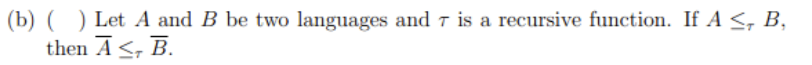
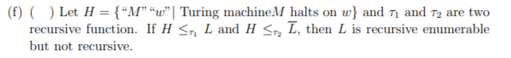
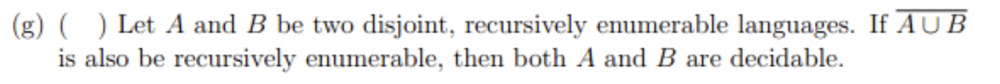
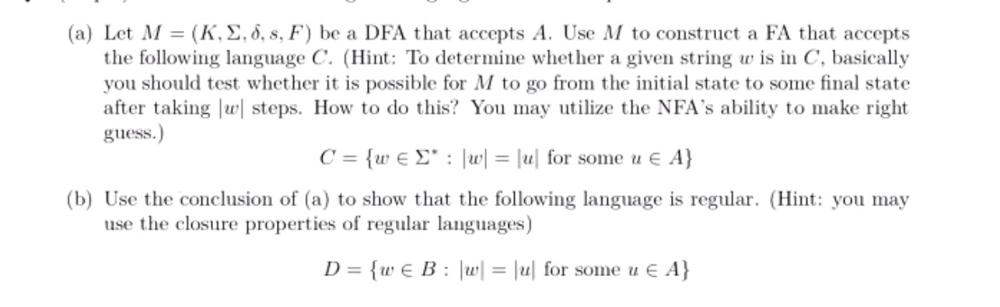
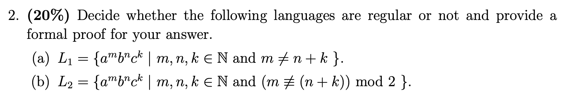
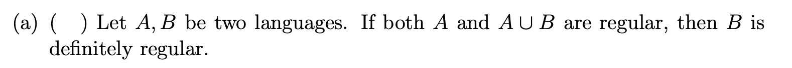
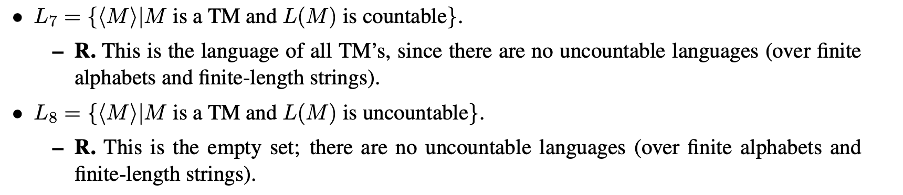
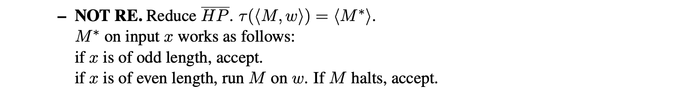

记结论！

用到了前面的结论。因为 H≤L 补，所以 H 补 ≤L。如果 L 是递归可枚举的，那么 H 补也是递归可枚举，那么 H 就是递归的，矛盾。

首先A并B是递归的，那么肯定存在一个图灵机判定输入是否属于A并B；又因为A/B都是递归可枚举的，一定存在两个图灵机半判定输入是否属于A或B。那么先用第一个图灵机判定，如果N则N，如果Y（说明输入要么属于A要么属于B）则用后面两个图灵机轮流跑，必然有一方会停机，A停机则Y，B停机则N。这样就完成了对输入属于A的判定。

- 上下文无关语言中任意一个串，取出前面若干长度作为子串，也是上下文无关的。因为PDA非确定，在原PDA上给每个状态之间都挂一个e转移，那么前缀由原PDA接受，缺省的后缀由e转移到终结状态即可。
- 类似的，下面这张图里
  - a将判定A的FA所有转移条件都变成字母表全体，就可以实现
  - c只是将字母表换了一下，将原FA的转移条件对应的切换即可
  - 

regular对补封闭，注意证明时条件的等于或者不等于是一样的。这里证等于方便很多。

错的，常用的举例比如sigma*与anbn。

Rice定理，空集和全集的子标集是递归的，这里直接当结论用了。

